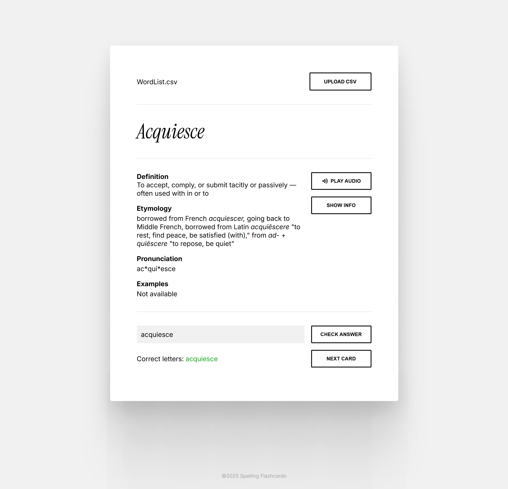

# Spelling Flashcards
A simple web app for practicing your choice of hard-to-remember words.

# About
Spelling Flashcards is a web application designed to help users improve their spelling skills by practicing with custom word lists. Users can upload a CSV file containing words they want to practice, and the app will generate flashcards for each word. Each flashcard displays the word's definition, pronunciation, etymology, and example sentences using data from Merriam-Webster. Users can type their answers to check their spelling, and the app provides feedback by highlighting correct and incorrect letters. Audio playback for the word will play for each card, additionally there is a button to repeat the playback.

# Usage
To use the app, prepare a CSV file with a single column containing the words you want to practice. Ensure that the file does not include any headers or extra formatting, just a plain list of words, one per line. Once your file is ready, upload it through the app's interface, and it will process the file and create flashcards for each word.